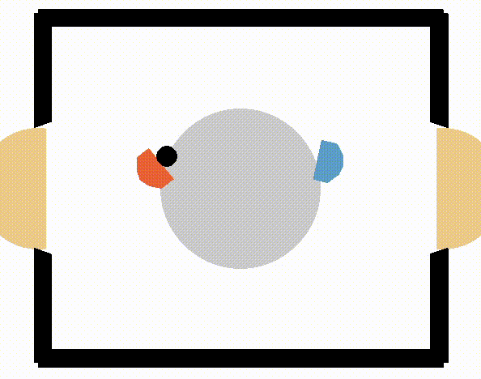

# AirHockey RL — TD3 & SAC

  
*TD3 self-play (TD3 agent vs TD3 agent).*

Train two reinforcement learning agents—**TD3** and **SAC**—to master a continuous-control **AirHockey** environment.

---

## 📌 What this is
- Minimal, focused repo with TD3 and SAC training scripts  
- Quick demo notebook to render the environment  
- Short presentation with gameplay clips and performance plots (see **docs/**)  

---

## 🎯 What it does
- Trains **TD3** and **SAC** agents on the same AirHockey task  
- Lets you easily tweak hyperparameters (e.g., policy noise, policy delay)  
- (Optional) Logs training runs to **Weights & Biases** for tracking  

---

## 🚀 How to use

**Requirements:** Python **3.10+**

**Install dependencies:**

```bash
pip install -r requirements.txt

**Train TD3:**

```bash
python TD3/main.py

**Train SAC:**

```bash
python/SAC/main.py

Environment demo: Open example_run.ipynb and run the cell to render a short random-action rollout.

## 📂 details
Slides with gameplay clips & results: docs/rl-hockey-presentation.pptx
Source video for GIF (optional): docs/td3_demo.mp4

## 📜 License
MIT License
